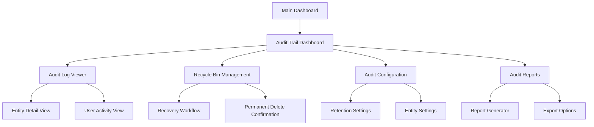

# Audit Trail Feature Expansion Requirements

## 1. Product Overview

The audit trail feature serves as a comprehensive ledger system that records all significant actions within the MD Sports application, ensuring complete traceability and recoverability of data changes. Currently, the system has partial audit coverage for some entities like customers, quotations, invoices, receipts, products, and categories, but many critical business entities lack proper audit trail integration.

This expansion aims to achieve 100% audit coverage across all business entities, ensuring every create, update, and delete operation is properly logged and recoverable when appropriate.

## 2. Core Features

### 2.1 User Roles

| Role | Registration Method | Core Permissions |
|------|---------------------|------------------|
| System Administrator | Admin creation | Full audit trail access, can view all logs, recover any items, permanently delete items |
| Shop Manager | Admin assignment | Can view audit logs for their shop, recover items from their shop |
| Shop Staff | Manager assignment | Can view basic audit logs for their actions, limited recovery permissions |
| Accountant | Admin assignment | Can view financial audit logs, payment and invoice audit trails |

### 2.2 Feature Module

Our audit trail expansion consists of the following main areas:

1. **Audit Trail Dashboard**: comprehensive audit log viewer, advanced filtering, export capabilities, real-time audit monitoring.
2. **Recycle Bin Management**: deleted items recovery interface, bulk recovery operations, permanent deletion controls.
3. **Entity Coverage Expansion**: audit integration for all missing entities, standardized audit logging patterns.
4. **Audit Configuration**: configurable audit settings, retention policies, audit level controls.
5. **Audit Reports**: audit summary reports, compliance reports, user activity reports.
6. **Data Recovery Tools**: advanced recovery workflows, data integrity validation, recovery history tracking.

### 2.3 Page Details

| Page Name | Module Name | Feature description |
|-----------|-------------|---------------------|
| Audit Trail Dashboard | Audit Log Viewer | Display paginated audit logs with filtering by entity, action, user, date range. Advanced search functionality across all audit data. |
| Audit Trail Dashboard | Real-time Monitor | Live updates of audit activities, notification system for critical actions, activity timeline visualization. |
| Recycle Bin Management | Deleted Items List | Show all recoverable deleted items with entity type, deletion date, deleted by user, and recovery status. |
| Recycle Bin Management | Bulk Operations | Select multiple items for bulk recovery or permanent deletion, batch processing with progress indicators. |
| Recycle Bin Management | Recovery Workflow | Step-by-step recovery process with data validation, conflict resolution, and recovery confirmation. |
| Audit Configuration | Retention Settings | Configure audit log retention periods, automatic cleanup policies, storage optimization settings. |
| Audit Configuration | Entity Settings | Enable/disable audit logging per entity, configure audit detail levels, set recovery permissions. |
| Audit Reports | Activity Reports | Generate user activity reports, entity change summaries, compliance audit reports with export options. |
| Audit Reports | System Reports | System-wide audit statistics, performance metrics, data integrity reports. |

## 3. Core Process

### 3.1 Audit Logging Flow
1. User performs any CRUD operation on a business entity
2. System automatically captures the action details (before/after data, user context, timestamp)
3. Audit entry is created in the audit log with appropriate metadata
4. For delete operations, original data is preserved for potential recovery
5. Audit log is immediately available in the audit trail dashboard

### 3.2 Recovery Flow
1. User navigates to Recycle Bin from Audit Trail page
2. User browses deleted items with filtering and search capabilities
3. User selects item(s) for recovery and initiates recovery process
4. System validates recovery feasibility and checks for conflicts
5. User confirms recovery after reviewing impact
6. System restores the entity and logs the recovery action
7. User receives confirmation and can verify restored data

### 3.3 Page Navigation Flow

## 4. User Interface Design

### 4.1 Design Style

- **Primary Colors**: Blue (#3B82F6) for primary actions, Red (#EF4444) for destructive actions
- **Secondary Colors**: Gray (#6B7280) for secondary elements, Green (#10B981) for success states
- **Button Style**: Rounded corners (8px), subtle shadows, hover state animations
- **Font**: Inter font family, 14px base size for body text, 16px for headings
- **Layout Style**: Card-based design with clean borders, consistent spacing (16px grid), top navigation with breadcrumbs
- **Icons**: Lucide React icons for consistency, 16px standard size, 20px for primary actions

### 4.2 Page Design Overview

| Page Name | Module Name | UI Elements |
|-----------|-------------|-------------|
| Audit Trail Dashboard | Main Layout | Top navigation with tabs (Audit History, Recycle Bin, Configuration, Reports), search bar, filter dropdowns, pagination controls |
| Audit Trail Dashboard | Audit Log Table | Sortable columns (Date, User, Action, Entity, Details), expandable rows for detailed view, action badges with color coding |
| Recycle Bin Management | Item Grid | Card-based layout showing entity preview, deletion metadata, recovery status, bulk selection checkboxes |
| Recycle Bin Management | Action Panel | Floating action bar with Recover and Delete buttons, progress indicators for bulk operations |
| Audit Configuration | Settings Form | Toggle switches for entity audit settings, slider controls for retention periods, save/reset buttons |
| Audit Reports | Report Builder | Date range picker, entity selector, report type dropdown, preview panel, export format options |

### 4.3 Responsiveness

The audit trail interface is desktop-first with mobile-adaptive design. Tables collapse to card views on mobile devices, with touch-optimized controls for selection and actions. The interface supports both mouse and touch interactions for maximum accessibility.

## 5. Technical Implementation Requirements

### 5.1 Missing Entity Coverage

The following entities currently lack audit trail integration and must be added:

**High Priority Entities:**
- Users (create, update, deactivate, role changes)
- Shops (create, update, status changes)
- Inventory Transfers (create, update, status changes, approval workflow)
- Purchase Invoices (create, update, delete, payment status)
- Inventory Items (stock adjustments, transfers, additions)
- Roles and Permissions (create, update, assignment changes)
- System Settings (configuration changes)

**Medium Priority Entities:**
- Accounts (create, update, balance changes)
- Transactions (create, update, reversal)
- Notifications (create, read status, deletion)
- Invoice Items (quantity/price changes)
- Quotation Items (modifications)
- Purchase Invoice Items (changes)

### 5.2 Audit Service Enhancements

Required improvements to the existing AuditService:

1. **Batch Audit Logging**: Support for logging multiple related actions as a single transaction
2. **Audit Metadata**: Enhanced metadata capture including IP address, user agent, session context
3. **Audit Validation**: Data integrity checks and audit log validation
4. **Performance Optimization**: Async audit logging, batch processing, database indexing
5. **Audit Compression**: Compress large audit payloads for storage efficiency

### 5.3 Recovery System Enhancements

1. **Dependency Resolution**: Handle entity relationships during recovery
2. **Conflict Detection**: Identify and resolve data conflicts before recovery
3. **Partial Recovery**: Support for recovering specific fields or relationships
4. **Recovery Validation**: Verify data integrity after recovery operations
5. **Recovery Rollback**: Ability to undo recovery operations if issues arise

### 5.4 Database Schema Updates

Required changes to support enhanced audit functionality:

1. **Audit Log Indexing**: Add indexes for common query patterns (entity+entityId, userId+createdAt, action+entity)
2. **Audit Metadata Fields**: Add fields for IP address, user agent, session ID, request ID
3. **Audit Relationships**: Link related audit entries for transaction-like operations
4. **Retention Policies**: Add fields for audit retention and cleanup scheduling

### 5.5 API Enhancements

Required API modifications for complete audit coverage:

1. **Standardized Audit Middleware**: Create reusable middleware for automatic audit logging
2. **Audit Context**: Capture and pass audit context through request pipeline
3. **Bulk Operations**: Audit support for bulk create/update/delete operations
4. **Error Auditing**: Log failed operations and error conditions
5. **Performance Monitoring**: Track audit logging performance and optimize bottlenecks

## 6. Success Criteria

### 6.1 Functional Requirements
- 100% entity coverage for audit logging
- Sub-second audit log retrieval for standard queries
- 99.9% audit log reliability (no lost audit entries)
- Complete data recovery capability for all soft-deleted entities
- Real-time audit monitoring and alerting

### 6.2 Performance Requirements
- Audit logging should not add more than 50ms to API response times
- Audit dashboard should load within 2 seconds
- Support for 10,000+ audit entries with smooth pagination
- Bulk recovery operations should handle 100+ items efficiently

### 6.3 Security Requirements
- Audit logs are immutable once created
- Access control based on user roles and permissions
- Audit log encryption for sensitive data
- Secure audit log export with access tracking

## 7. Implementation Phases

### Phase 1: Core Infrastructure (Week 1-2)
- Enhance AuditService with missing functionality
- Implement audit middleware for automatic logging
- Add database indexes and schema improvements
- Create standardized audit logging patterns

### Phase 2: Entity Coverage (Week 3-4)
- Implement audit logging for high-priority entities
- Add soft delete functionality where missing
- Enhance recovery workflows for complex entities
- Test audit coverage across all CRUD operations

### Phase 3: UI/UX Improvements (Week 5-6)
- Enhance audit trail dashboard with advanced features
- Improve recycle bin interface with bulk operations
- Add audit configuration and reporting capabilities
- Implement real-time audit monitoring

### Phase 4: Testing and Optimization (Week 7-8)
- Comprehensive testing of audit functionality
- Performance optimization and load testing
- Security audit and penetration testing
- Documentation and user training materials

This comprehensive audit trail expansion will ensure complete data traceability and recoverability across the entire MD Sports application, providing robust data governance and compliance capabilities.