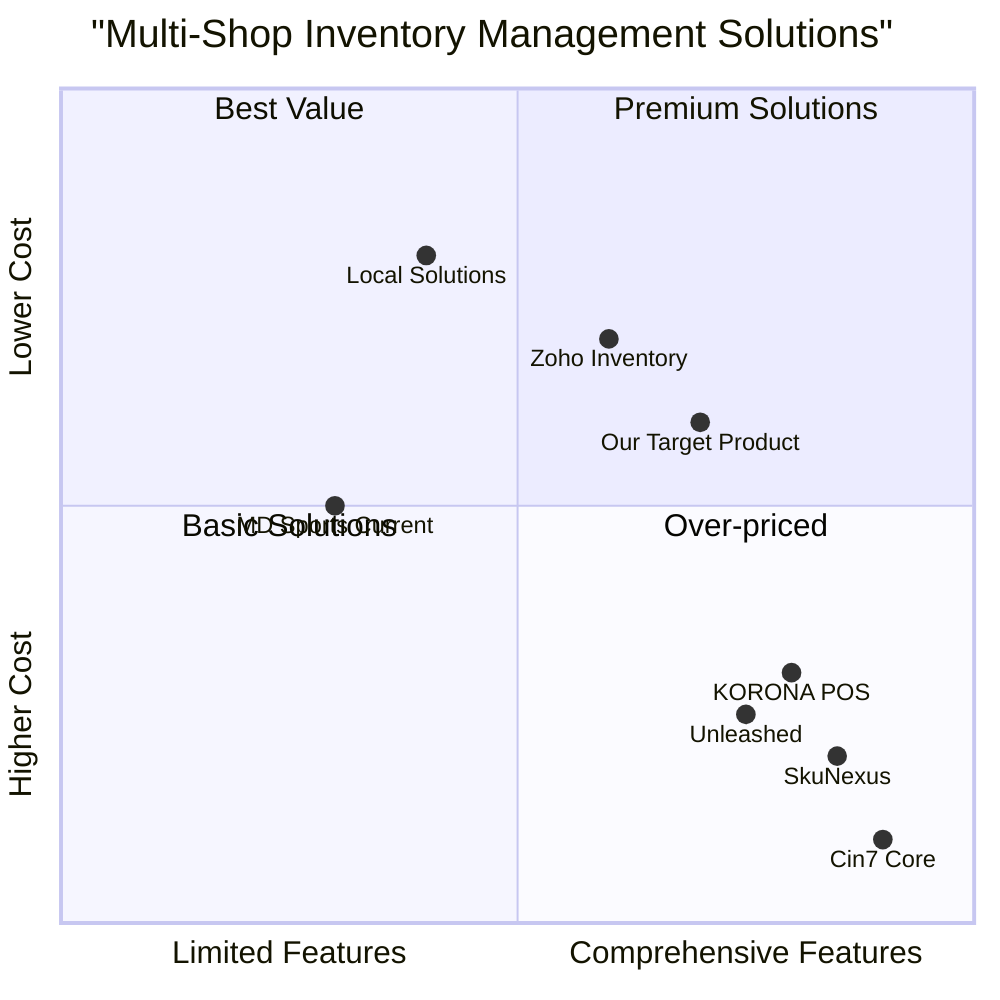

# Product Requirements Document (PRD)

## MD Sports Multi-Shop Inventory Management System

**Created by:** Emma, Product Manager
**Date:** May 18, 2025
**Client:** MD Sports
**Service Provider:** Synapse Labs

## Original Requirements

MD Sports, a retail business with multiple shop locations in Sri Lanka, requires an inventory management system with the following capabilities:

1. Inventory management with transfer capability between shops
2. Adding/removing shops from the system
3. Role-based access control (e.g., cashiers can only create/print invoices)
4. Admin capabilities to manage users (CRUD operations) and their access
5. Separate inventory reports for each shop
6. SMS integration for invoice creation and overdue notifications
7. Customer classification (credit vs. cash customers)
8. Database using NeonDB
9. Export features for reports (PDF and Excel)
10. AI integration using ChatGPT 4o-mini

## 1. Product Definition

### 1.1 Product Goals

1. **Streamline Multi-Location Operations:** Create a centralized system that enables MD Sports to efficiently manage inventory across all shop locations, with real-time visibility and seamless transfer capabilities.

2. **Enhance Business Intelligence:** Provide comprehensive reporting and analytics to enable data-driven decision-making for purchasing, sales strategies, and business growth.

3. **Improve Customer Experience:** Implement features that enable better customer service through accurate inventory information, efficient invoicing, and proactive communication.

### 1.2 User Stories

1. **As the business owner (admin)**, I want to view consolidated inventory across all shops, so that I can make informed purchasing decisions.

2. **As a shop manager**, I want to transfer inventory items between shops, so that I can fulfill customer demands without purchasing additional stock.

3. **As a cashier**, I want to quickly create and print invoices for customers, so that I can efficiently process sales transactions.

4. **As an inventory manager**, I want to receive low stock notifications, so that I can reorder products before they run out.

5. **As an accountant**, I want to generate sales and inventory reports by shop location, so that I can analyze the performance of each outlet.

### 1.3 Competitive Analysis

#### KORONA POS
- **Pros:** Real-time multi-location synchronization, customizable reporting, excellent customer support
- **Cons:** Higher price point, potential feature overload for simpler operations

#### Cin7 Core
- **Pros:** Superior supply chain visibility, warehouse management, mobile scanner integration
- **Cons:** High starting price, steep learning curve

#### Zoho Inventory
- **Pros:** Budget-friendly, cloud-based, integrates with Zoho ecosystem
- **Cons:** Limited customization options, requires upgrade for advanced features

#### SkuNexus
- **Pros:** Highly customizable, scalable for businesses of all sizes
- **Cons:** Custom pricing can be costly, implementation can be complex

#### Unleashed
- **Pros:** Real-time inventory management, advanced reporting
- **Cons:** Higher price point, primarily focused on wholesale/manufacturing

#### Local Sri Lankan Solutions
- **Pros:** Better understanding of local market needs, potential for more cost-effective pricing
- **Cons:** May lack advanced features, potentially less scalable

#### MD Sports Current System
- **Pros:** Users already familiar, existing data structure
- **Cons:** Lacks inter-shop transfer capabilities, limited reporting, no AI capabilities

### 1.4 Competitive Quadrant Chart

## 2. Technical Specifications

### 2.1 Requirements Analysis

The MD Sports Inventory Management System will be a web-based application built using modern web technologies. The system will leverage a responsive design approach to ensure accessibility across devices. The application will be centered around the following core modules:

1. **Inventory Management:** Core module for tracking products across multiple shop locations
2. **Shop Management:** Module for adding, editing, and managing shop locations
3. **User Management:** Role-based access control system
4. **Invoice Management:** Sales processing and records
5. **Customer Management:** Customer profiles with classification (credit/cash)
6. **Reporting & Analytics:** Business intelligence with export capabilities
7. **AI Integration:** ChatGPT 4o-mini integration for enhanced functionality
8. **SMS Notifications:** Integration with notify.lk for automated communications

The application will be deployed on a cloud infrastructure and will utilize NeonDB as the database solution. API-driven architecture will ensure flexibility and future extensibility.

### 2.2 Requirements Pool

#### P0 (Must-Have Features)

1. **Inventory Management**
   - Product catalog with SKUs, descriptions, pricing, and categorization
   - Real-time stock tracking across multiple shop locations
   - Inventory transfer capabilities between shops with transfer history
   - Low stock alerts and notifications

2. **Shop Management**
   - Add, edit, and remove shop locations
   - Shop-specific settings and configurations
   - Shop performance dashboards

3. **User Management**
   - Role-based access control (Admin, Manager, Cashier, etc.)
   - User CRUD operations (create, read, update, delete)
   - Permission management for different functionalities

4. **Invoice Management**
   - Create and print invoices
   - Invoice history and search
   - Basic invoice reporting

5. **Customer Management**
   - Customer classification (credit vs. cash)
   - Basic customer profiles
   - Customer transaction history

6. **Reporting**
   - Inventory reports by shop
   - Sales reports by shop
   - Export functionality (PDF and Excel)

7. **SMS Integration**
   - Integration with notify.lk
   - SMS notifications for invoice creation
   - SMS alerts for overdue payments

8. **Database Implementation**
   - NeonDB setup and configuration
   - Data migration from existing system
   - Backup and recovery procedures

#### P1 (Should-Have Features)

1. **Advanced Reporting**
   - Cross-shop comparison reports
   - Trend analysis for sales and inventory
   - Custom report generation

2. **AI Integration**
   - ChatGPT 4o-mini for inventory recommendations
   - AI-powered sales forecasting
   - Natural language query capability for data analysis

3. **Enhanced User Experience**
   - Mobile-responsive design
   - Drag-and-drop inventory transfer interface
   - Customizable dashboards

4. **Enhanced Customer Management**
   - Detailed customer profiles
   - Customer purchase history analysis
   - Customer loyalty tracking

5. **Extended Invoice Features**
   - Invoice templates
   - Partial payment tracking
   - Invoice reminders

#### P2 (Nice-to-Have Features)

1. **Advanced AI Features**
   - Automated stock replenishment suggestions
   - Customer behavior analysis
   - Price optimization recommendations

2. **Supplier Management**
   - Supplier profiles and contact information
   - Purchase order management
   - Supplier performance metrics

3. **E-commerce Integration**
   - Online store connection
   - Inventory synchronization with e-commerce platform
   - Order fulfillment management

4. **Advanced Analytics**
   - Visual analytics dashboard
   - Custom KPI tracking
   - Predictive analytics for inventory needs

5. **Mobile Application**
   - Native mobile app for iOS and Android
   - Barcode scanning functionality
   - Mobile invoice generation

### 2.3 UI Design Draft

#### Dashboard Overview

The main dashboard will provide a consolidated view of key metrics and quick access to primary functions:

- **Top Header:** Logo, shop selector, notifications, user profile
- **Left Sidebar:** Main navigation menu with modules
- **Main Content Area:** Dashboard widgets including:
  - Inventory summary across shops
  - Recent transfers between shops
  - Low stock alerts
  - Sales performance by shop
  - Recent invoices
  - Quick actions (create invoice, transfer inventory, etc.)

#### Inventory Management Screen

- **Inventory Filter Panel:** Filter by shop, category, stock level, etc.
- **Product List View:** Sortable table with product details
- **Product Detail View:** Complete information for selected product
- **Transfer Panel:** Interface for initiating inventory transfers between shops
- **Inventory History:** Log of inventory changes and transfers

#### Shop Management Screen

- **Shop List View:** Overview of all shops
- **Shop Detail View:** Complete information and settings for selected shop
- **Add/Edit Shop Form:** Interface for creating or modifying shop information
- **Shop Performance:** Key metrics specific to selected shop

#### User Management Screen

- **User List:** Overview of all system users
- **Role Management:** Interface for defining and assigning roles
- **Permission Matrix:** Visual editor for role-based permissions
- **User Activity Logs:** Tracking of user actions within the system

#### Invoice Creation Screen

- **Customer Selection:** Search and select customer
- **Product Selection:** Add products to invoice with quantity
- **Pricing and Discounts:** Apply pricing rules and discounts
- **Payment Processing:** Handle different payment methods
- **Print/Email/SMS Options:** Distribution options for completed invoice

#### Reporting Interface

- **Report Selection Panel:** Choose report type and parameters
- **Report Preview:** Visual preview of generated report
- **Export Options:** PDF and Excel export functionality
- **Saved Reports:** Access to previously generated reports

### 2.4 Open Questions

1. **Existing Data Migration Strategy**
   - What is the format and quality of the existing inventory data?
   - Are there any legacy data structures that need special handling?

2. **Integration Requirements**
   - Are there any additional third-party systems that need integration?
   - What are the specific SMS notification templates required?

3. **Hardware Considerations**
   - What are the specifications of the existing hardware at each shop?
   - Will barcode scanners or other special hardware be used?

4. **AI Use Cases**
   - What specific insights is the client looking to gain from AI integration?
   - What business decisions should be informed by AI recommendations?

5. **Scalability Requirements**
   - What is the anticipated growth in terms of shop locations?
   - What volume of inventory and transactions should the system be designed to handle?

## 3. Recommended Additional Features

Based on industry best practices and competitive analysis, we recommend the following additional features to enhance the system:

### 3.1 Inventory Management Enhancements

1. **Batch and Serial Number Tracking**
   - Track products by batch or serial numbers
   - Useful for warranty management and recalls
   - Critical for certain product types with expiration dates

2. **Barcode Generation and Scanning**
   - Generate barcode labels for products
   - Support for barcode scanning for faster operations
   - Inventory counts using mobile scanners

3. **Multi-level Categories and Attributes**
   - Hierarchical product categorization
   - Custom product attributes and variants
   - Advanced filtering and search capabilities

### 3.2 Business Intelligence Tools

1. **Interactive Reports and Dashboards**
   - Visual data exploration
   - Customizable dashboards for different roles
   - Drill-down capability for detailed analysis

2. **Seasonal Trend Analysis**
   - Identify seasonal sales patterns
   - Plan inventory based on historical performance
   - Anticipate customer demand

### 3.3 Customer Relationship Features

1. **Loyalty Program Integration**
   - Points system for purchases
   - Rewards and special offers
   - Customer retention tools

2. **Customer Feedback System**
   - Collect feedback after purchase
   - Review and rating system
   - Customer satisfaction tracking

### 3.4 AI-Powered Enhancements

1. **Virtual Inventory Assistant**
   - Natural language interface for inventory queries
   - AI-guided inventory optimization
   - Anomaly detection in inventory patterns

2. **Predictive Analytics**
   - Sales forecasting by shop and product
   - Automatic purchase recommendations
   - Cash flow predictions

## 4. Implementation Plan

### 4.1 Project Timeline

The project will be completed by the first week of June 2025, with the following key milestones:

| Phase | Timeline | Activities |
|-------|----------|------------|
| **Requirements Finalization** | Week 1 | Confirm requirements, resolve open questions, finalize feature set |
| **Design** | Week 2 | Database design, UI/UX design, architecture planning |
| **Development Phase 1** | Weeks 3-4 | Core modules: Inventory, Shop, User Management |
| **Development Phase 2** | Weeks 5-6 | Additional modules: Invoicing, Reporting, Customer Management |
| **Integration** | Week 7 | AI integration, SMS integration, Export functionalities |
| **Testing** | Weeks 8-9 | QA testing, bug fixes, performance optimization |
| **Deployment Preparation** | Week 10 | Data migration, training documentation, deployment planning |
| **Deployment** | Week 11 | System deployment, go-live, initial support |

### 4.2 Team Allocation

- **2 Developers**
  - Developer 1: Backend development, database design, API integration
  - Developer 2: Frontend development, UI implementation, reporting features

- **1 Tester**
  - Responsible for test planning, test case creation, and execution
  - Regression testing and UAT support

- **QA Engineer**
  - Quality assurance processes
  - Performance testing
  - Security validations

- **Project Manager**
  - Client communication
  - Resource coordination
  - Timeline management

### 4.3 Cost Breakdown

Total Budget: 140,000 LKR

| Cost Category | Amount (LKR) | Percentage | Description |
|--------------|--------------|------------|-------------|
| **Development** | 80,000 | 57.1% | Developer salaries, coding, implementation |
| **Testing & QA** | 20,000 | 14.3% | Testing resources, quality assurance processes |
| **Project Management** | 15,000 | 10.7% | Project coordination, client meetings, documentation |
| **Design** | 10,000 | 7.1% | UI/UX design, database architecture |
| **Setup & Configuration** | 8,000 | 5.7% | NeonDB setup, environment configuration |
| **Training** | 5,000 | 3.6% | User training, documentation creation |
| **Contingency** | 2,000 | 1.4% | Buffer for unexpected challenges |
| **Total** | 140,000 | 100% | |

### 4.4 Monthly Costs

| Item | Monthly Cost (LKR) | Description |
|------|--------------|-------------|
| **notify.lk SMS Package** | 1,500 | Startup package with 1,180 free SMS monthly |
| **ChatGPT API Top-up** | Variable | Based on usage, approximately 0.15 USD per 1M input tokens, 0.60 USD per 1M output tokens |
| **NeonDB Hosting** | Included in project cost | Initial setup and first year hosting included |

## 5. Technical Architecture

### 5.1 Technology Stack

- **Frontend**: React.js with Tailwind CSS for responsive design
- **Backend**: Node.js with Express.js framework
- **Database**: NeonDB (PostgreSQL-compatible)
- **Authentication**: JWT-based authentication system
- **Reporting Engine**: Custom reporting with PDF and Excel export libraries
- **Integration**: RESTful APIs for service integration
- **AI Integration**: OpenAI API (ChatGPT 4o-mini)
- **SMS Integration**: notify.lk API

### 5.2 Database Schema Overview

The database will include the following core entities and relationships:

- **Products**: Central product catalog with common information
- **Inventory**: Product quantities and locations across shops
- **Shops**: Shop locations and specific details
- **Users**: System users with roles and permissions
- **Customers**: Customer profiles and classifications
- **Invoices**: Sales transactions and line items
- **Transfers**: Inter-shop inventory movement records
- **Audit Trail**: System activity logs for accountability

### 5.3 Integration Architecture

- **ChatGPT Integration**: RESTful API calls to OpenAI with context management
- **SMS Integration**: notify.lk API for automated messaging
- **Export Integration**: Server-side generation of PDF and Excel reports

### 5.4 Deployment Strategy

- **Development Environment**: Local development with containerization
- **Staging Environment**: Cloud-based testing environment
- **Production Environment**: Cloud hosting with automated backups
- **CI/CD Pipeline**: Automated testing and deployment processes

## 6. Risk Assessment and Mitigation

### 6.1 Identified Risks

| Risk | Probability | Impact | Mitigation Strategy |
|------|------------|--------|---------------------|
| Data migration issues | Medium | High | Thorough data analysis, migration testing, fallback strategy |
| User adoption challenges | Medium | Medium | User-friendly design, comprehensive training, phased rollout |
| Integration complexity | Medium | Medium | Early proof-of-concept, incremental integration approach |
| Performance bottlenecks | Low | High | Performance testing, optimization, scalable architecture |
| Budget constraints | Low | Medium | Clear scope definition, regular budget reviews, prioritization |
| Timeline pressure | Medium | Medium | Agile methodology, regular progress tracking, scope management |

### 6.2 Contingency Plans

1. **Data Integrity Issues**: Implement data verification processes and reconciliation tools
2. **Performance Challenges**: Identify optimization opportunities and implement caching strategies
3. **Integration Failures**: Develop fallback mechanisms and manual override capabilities
4. **Resource Constraints**: Cross-train team members and prepare for flexible resource allocation

## 7. Conclusion

The MD Sports Multi-Shop Inventory Management System will provide a comprehensive solution for managing inventory across multiple retail locations. By implementing this system, MD Sports will gain improved visibility into their inventory, streamline operations, and enhance customer service. The project leverages modern technologies including AI integration and cloud database solutions to deliver a scalable, future-proof platform.

The development team is prepared to deliver the solution within the specified budget and timeline, with a focus on the core requirements while implementing additional features where possible to maximize business value. Regular communication and collaborative development will ensure that the final product meets MD Sports' specific needs and provides a strong foundation for future growth.

---

© 2025 Synapse Labs | All Rights Reserved
