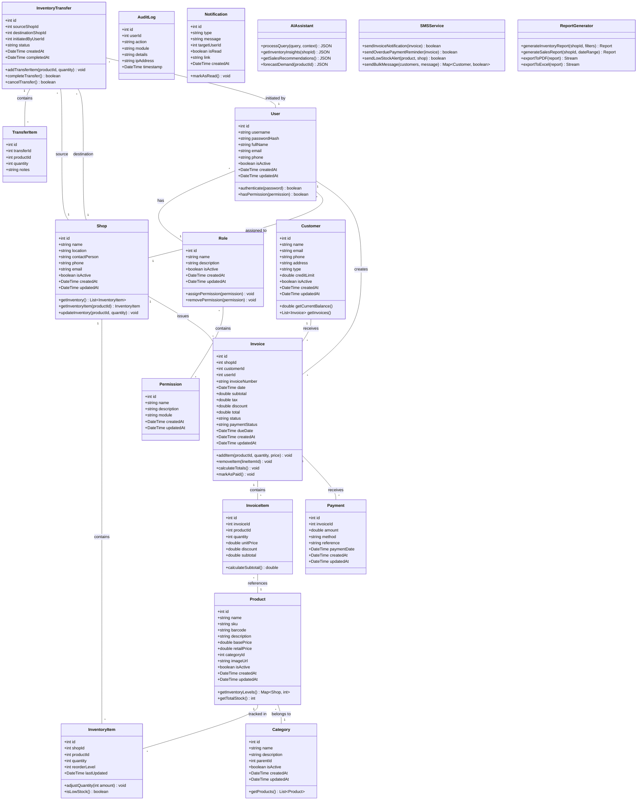
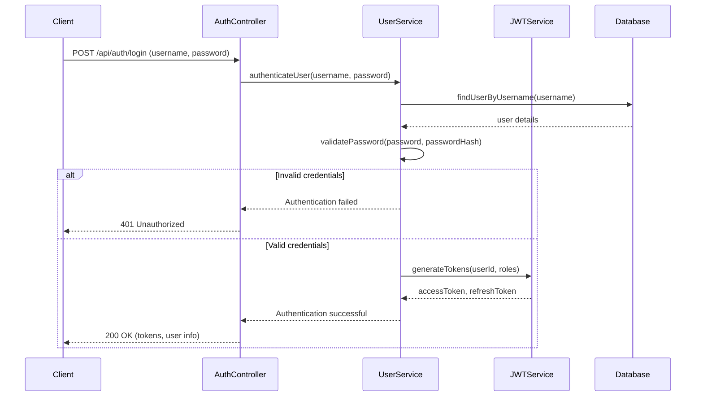
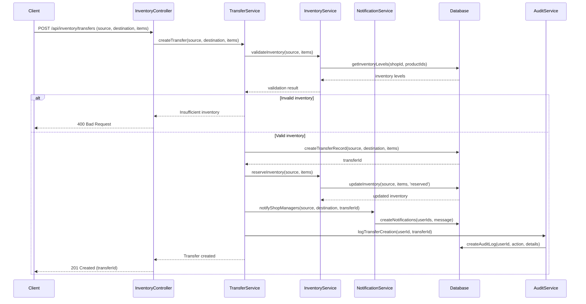
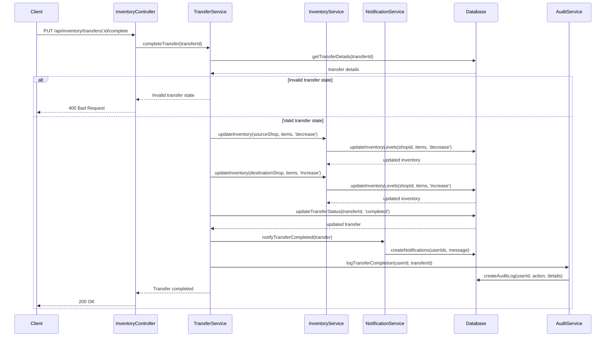
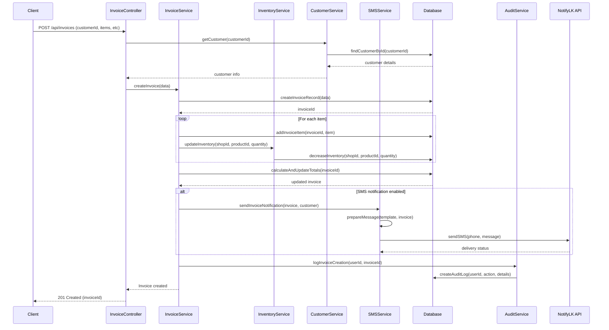
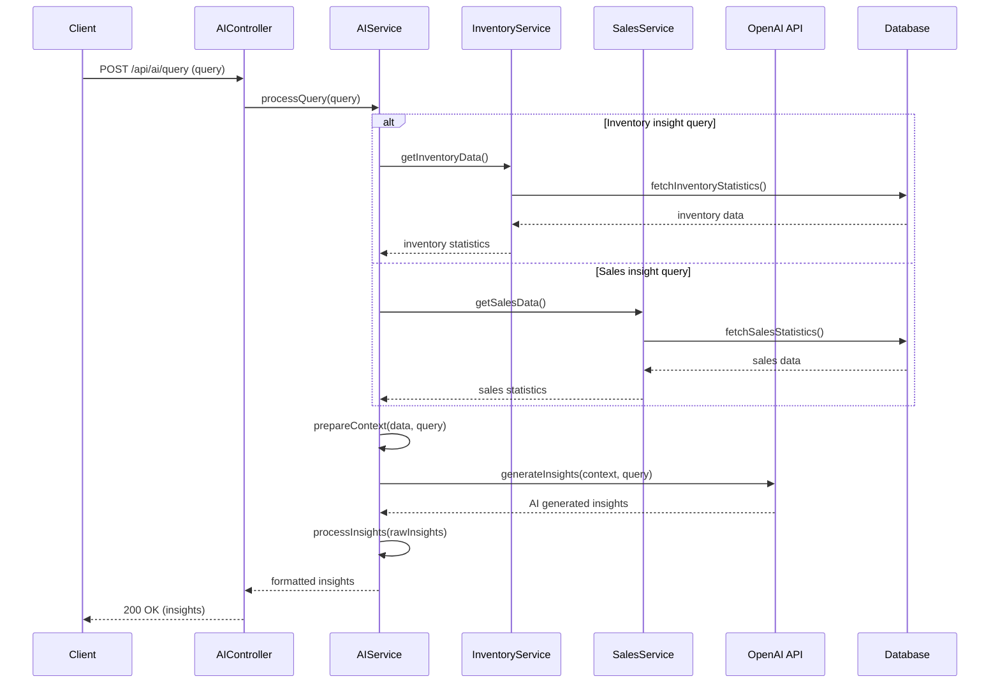

# MD Sports Inventory Management System - System Design

## Implementation approach

Based on the requirements outlined in the PRD, I'll design a web-based inventory management system for MD Sports that enables multi-shop inventory management with transfer capabilities, role-based access control, and comprehensive reporting features. The system will be built using modern web technologies that offer reliability, scalability, and security while remaining within budget constraints.

### Key Technical Decisions

1. **Architecture Pattern**: We will implement a microservices-oriented architecture to ensure modularity and scalability. This will allow us to independently scale different components of the system as needed.

2. **Technology Stack**:
   - Frontend: React.js with Tailwind CSS for responsive design
   - Backend: Node.js with Express.js for API development
   - Database: NeonDB (PostgreSQL-compatible) for reliable data storage
   - Authentication: JWT-based token system with role-based permissions

3. **Integration Approach**:
   - RESTful APIs for service integration
   - Webhook-based notifications for real-time updates
   - OpenAI API for ChatGPT 4o-mini integration
   - notify.lk API for SMS functionality

4. **Deployment Strategy**:
   - Cloud-based deployment for accessibility and reliability
   - Containerization for consistent environment management
   - CI/CD pipeline for automated testing and deployment

### Challenging Aspects and Solutions

1. **Real-time Inventory Synchronization**: 
   - Challenge: Ensuring inventory data is consistent across multiple shops.
   - Solution: Implement event-driven architecture for inventory updates with robust concurrency control.

2. **Data Migration**:
   - Challenge: Migrating existing data without disruption.
   - Solution: Develop a comprehensive migration strategy with validation steps and rollback procedures.

3. **AI Integration**:
   - Challenge: Effectively leveraging ChatGPT 4o-mini for business insights.
   - Solution: Design a context management system to provide relevant business context to AI queries.

### Open Source Libraries

1. **Frontend**:
   - React.js - Component-based UI development
   - Redux Toolkit - State management
   - Tailwind CSS - Utility-first CSS framework
   - React Query - Data fetching and caching
   - React Hook Form - Form validation
   - Chart.js - Data visualization
   - jsPDF - PDF generation
   - SheetJS - Excel export

2. **Backend**:
   - Express.js - Web application framework
   - Sequelize ORM - Database interactions
   - Passport.js - Authentication middleware
   - Winston - Logging
   - Jest - Testing framework
   - Joi - Request validation
   - node-cron - Scheduled tasks
   - Nodemailer - Email functionality

## Data structures and interfaces

The system will be composed of several interconnected modules with well-defined data structures and APIs. Below is the class diagram representing the core entities and their relationships:



## Key API Endpoints

### Authentication API

```
POST /api/auth/login - User login
POST /api/auth/logout - User logout
POST /api/auth/refresh - Refresh authentication token
GET /api/auth/me - Get current user profile
PUT /api/auth/change-password - Change user password
```

### User Management API

```
GET /api/users - List all users
GET /api/users/:id - Get user details
POST /api/users - Create a new user
PUT /api/users/:id - Update user details
DELETE /api/users/:id - Deactivate a user
GET /api/users/:id/permissions - Get user permissions
PUT /api/users/:id/permissions - Update user permissions
```

### Role Management API

```
GET /api/roles - List all roles
GET /api/roles/:id - Get role details
POST /api/roles - Create a new role
PUT /api/roles/:id - Update role details
DELETE /api/roles/:id - Delete a role
GET /api/roles/:id/permissions - Get role permissions
PUT /api/roles/:id/permissions - Update role permissions
```

### Shop Management API

```
GET /api/shops - List all shops
GET /api/shops/:id - Get shop details
POST /api/shops - Create a new shop
PUT /api/shops/:id - Update shop details
DELETE /api/shops/:id - Deactivate a shop
GET /api/shops/:id/inventory - Get shop inventory
GET /api/shops/:id/staff - Get shop staff members
```

### Product Management API

```
GET /api/products - List all products
GET /api/products/:id - Get product details
POST /api/products - Create a new product
PUT /api/products/:id - Update product details
DELETE /api/products/:id - Deactivate a product
GET /api/products/:id/inventory - Get product inventory across shops
GET /api/products/categories - Get product categories
```

### Inventory Management API

```
GET /api/inventory - List inventory items (with filtering)
GET /api/inventory/:shopId/:productId - Get specific inventory item
POST /api/inventory/adjust - Adjust inventory quantity
GET /api/inventory/low-stock - Get low stock items
POST /api/inventory/transfers - Create inventory transfer
GET /api/inventory/transfers - List inventory transfers
GET /api/inventory/transfers/:id - Get transfer details
PUT /api/inventory/transfers/:id/complete - Complete inventory transfer
PUT /api/inventory/transfers/:id/cancel - Cancel inventory transfer
```

### Customer Management API

```
GET /api/customers - List all customers
GET /api/customers/:id - Get customer details
POST /api/customers - Create a new customer
PUT /api/customers/:id - Update customer details
DELETE /api/customers/:id - Deactivate a customer
GET /api/customers/:id/invoices - Get customer invoices
GET /api/customers/:id/balance - Get customer balance
```

### Invoice Management API

```
GET /api/invoices - List all invoices
GET /api/invoices/:id - Get invoice details
POST /api/invoices - Create a new invoice
PUT /api/invoices/:id - Update invoice details
DELETE /api/invoices/:id - Cancel an invoice
POST /api/invoices/:id/items - Add invoice item
DELETE /api/invoices/:id/items/:itemId - Remove invoice item
POST /api/invoices/:id/payments - Record payment for invoice
GET /api/invoices/:id/print - Generate printable invoice
POST /api/invoices/:id/send-sms - Send invoice SMS notification
```

### Reporting API

```
GET /api/reports/inventory - Generate inventory report
GET /api/reports/sales - Generate sales report
GET /api/reports/revenue - Generate revenue report
GET /api/reports/customer - Generate customer report
GET /api/reports/export/pdf - Export report to PDF
GET /api/reports/export/excel - Export report to Excel
```

### AI Integration API

```
POST /api/ai/query - Process natural language query
GET /api/ai/insights/inventory - Get AI inventory insights
GET /api/ai/insights/sales - Get AI sales insights
GET /api/ai/forecast/demand - Get demand forecasts
```

### SMS Notification API

```
POST /api/sms/send - Send custom SMS
POST /api/sms/invoice - Send invoice notification
POST /api/sms/overdue - Send overdue payment reminder
POST /api/sms/low-stock - Send low stock alert
GET /api/sms/templates - Get SMS templates
```

## Program call flow

The following sequence diagrams outline the key workflows in the system:

### User Authentication Flow



### Inventory Transfer Flow



### Complete Transfer Flow



### Invoice Creation Flow



### AI Insights Flow



## Security Measures

### Role-Based Access Control (RBAC)

The system implements a comprehensive RBAC system with the following security features:

1. **Granular Permission System**:
   - Each API endpoint is mapped to specific permissions.
   - Permissions are grouped by module (inventory, invoice, user, etc.).
   - Actions are categorized (view, create, edit, delete).

2. **Role Hierarchy**:
   - Predefined roles: Admin, Shop Manager, Inventory Manager, Cashier, Read-only User.
   - Each role has a specific set of permissions.
   - Inheritance can be configured for role hierarchies.

3. **Permission Enforcement**:
   - Middleware checks for required permissions before processing requests.
   - Dynamically filters content based on user's permission level.
   - Audit logging for permission checks and access attempts.

### Authentication Security

1. **JWT-based Authentication**:
   - Short-lived access tokens (15-30 minutes).
   - Refresh tokens with longer validity.
   - JWT payload contains minimal user information and permissions.

2. **Password Security**:
   - Bcrypt password hashing with appropriate salt rounds.
   - Password complexity requirements.
   - Account lockout after failed attempts.

3. **Session Management**:
   - Secure, HTTP-only cookies for token storage.
   - CSRF protection measures.
   - IP-based session validation (optional).

### API Security

1. **Input Validation**:
   - Comprehensive request validation using Joi.
   - Sanitization of inputs to prevent injection attacks.
   - Rate limiting to prevent abuse.

2. **HTTPS Enforcement**:
   - All communications over TLS/SSL.
   - HSTS headers for added security.

3. **Error Handling**:
   - Generic error messages to users.
   - Detailed errors logged for troubleshooting.
   - No sensitive information in error responses.

## Deployment Strategy

### Infrastructure Setup

1. **Database Layer**:
   - NeonDB (PostgreSQL-compatible) for data storage.
   - Connection pooling for efficient resource usage.
   - Regular backups configured.

2. **Application Layer**:
   - Node.js backend services deployed on cloud VMs or container services.
   - Load balancing for horizontal scalability.
   - Auto-scaling based on request volume (where budget allows).

3. **Frontend Layer**:
   - Static assets served from CDN.
   - React application bundled and optimized for production.

4. **Integration Layer**:
   - Secure API connections to notify.lk for SMS.
   - OpenAI API integration for AI capabilities.

### CI/CD Pipeline

1. **Development Workflow**:
   - Feature branch development.
   - Pull request review process.
   - Automated tests for each PR.

2. **Testing Environments**:
   - Development environment for ongoing work.
   - Staging environment identical to production.
   - Production environment with restricted access.

3. **Deployment Process**:
   - Automated tests before deployment.
   - Blue/green deployment for zero downtime.
   - Rollback capability if issues are detected.

### Scalability Considerations

1. **Horizontal Scaling**:
   - Stateless API design allows for multiple instances.
   - Database connection pooling.
   - Caching layer for frequently accessed data.

2. **Performance Optimization**:
   - Database query optimization.
   - Efficient indexing strategies.
   - Pagination for large data sets.

3. **Multi-Shop Scalability**:
   - Database schema designed to handle many shops efficiently.
   - Data partitioning strategies for very large deployments.
   - Isolated resources for shops if necessary.

## Anything UNCLEAR

1. **Data Migration Strategy**: The PRD mentions the client already has a system in place. A detailed assessment of the existing data structure and quality would be necessary to develop a comprehensive migration plan. This would include:
   - Schema mapping between old and new systems
   - Data cleaning and transformation rules
   - Validation criteria for migrated data
   - Rollback procedures in case of migration issues

2. **SMS Notification Templates**: Specific templates for different notification types should be confirmed with the client:
   - Invoice creation notification format
   - Overdue payment reminder content
   - Low stock alert message structure

3. **Hardware Infrastructure**: More information is needed about the existing hardware at each shop location:
   - Availability and specs of POS terminals
   - Network connectivity between shops
   - Printing capabilities for invoices and reports

4. **AI Integration Scope**: While the system will integrate with ChatGPT 4o-mini, the specific use cases need further detailing:
   - What types of natural language queries will be supported?
   - What specific business insights are most valuable to extract?
   - How will AI-generated content be presented to users?